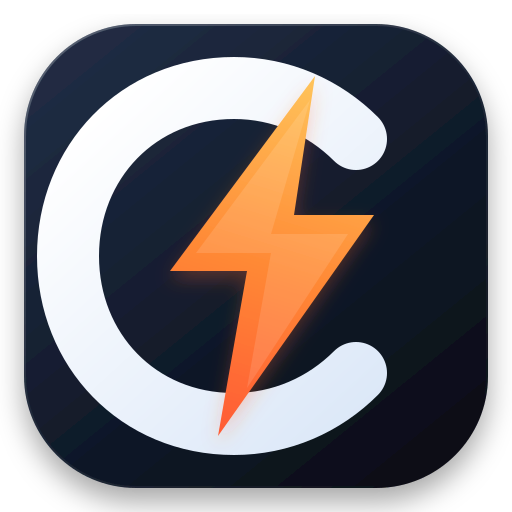

<p align="center">
  
</p>

<h1 align="center">LeigodClean</h1>

<p align="center">
  <a href="https://github.com/bunwright/leigod-clean/actions/workflows/ci.yml"></a>
  <a href="https://github.com/bunwright/leigod-clean/releases"></a>
  <a href="LICENSE"></a>
</p>

LeigodClean 是一个面向 Windows 的雷神加速器精简桌面界面。它保留游戏搜索、区服与线路选择、开始与停止加速、时长暂停与恢复等核心操作，并提供基于游戏进程生命周期的自动暂停。

## 功能

- 自动启动本机已安装的雷神客户端，并使用独立的精简界面完成日常操作。
- 从官方本地目录读取游戏名称、封面、区服、子区服及进程信息，默认优先显示最近使用和本机游戏。
- 获取账户当前可用线路，并通过官方客户端的业务流程开始和停止加速。
- 为每个游戏记忆上次使用的区服、子区服和线路，便于一键再次加速。
- 可为所有本地与近期游戏开启自动加速，也可为指定游戏设置独立且始终生效的自动加速规则。
- 通过 Windows 进程事件即时跟踪启动与退出，并将启动器和游戏本体视为同一进程会话。
- 游戏退出并超过可配置宽限时间后，自动停止加速并暂停账户时长。
- 显示加速状态、持续时间、延迟和丢包；按需提供最近 1、5 或 15 分钟的网络指标图表。
- 在系统托盘中查看会话、剩余时长和最近游戏，并可直接加速、暂停或恢复时长。
- 支持自定义进程名、启动等待、退出宽限、系统通知与关闭行为。
- 支持最小化到系统托盘，以及登录 Windows 后自动在托盘中静默运行。
- 登录或使用其他功能时，可从设置页打开完整官方界面。

## 安装与使用

### 要求

- Windows 10 或更高版本。
- .NET Framework 4.7.2 或更高版本（已包含在受支持的 Windows 更新中）。
- 已安装最新的雷神加速器 Windows 客户端。

### 首次运行

1. 从 [Releases](https://github.com/bunwright/leigod-clean/releases) 下载 `LeigodClean.exe`。
2. 完全退出正在运行的雷神客户端。
3. 将 `LeigodClean.exe` 保存在任意合适的位置并运行。Windows 会请求管理员权限，用于维护客户端入口并按官方启动器的权限要求启动客户端。
4. LeigodClean 会自动启动所需的官方客户端组件并显示精简界面。
5. 如账户尚未登录，点击左下角账户区域，在官方界面完成登录后返回。

之后通常只需启动 `LeigodClean.exe`。选择游戏后，上次使用的区服和线路会自动恢复；点击“一键加速”即可开始。

发布包未附带商业代码签名，Windows 可能显示 SmartScreen 提示。请仅从本仓库的 Releases 下载，并核对随包提供的 SHA-256 校验文件。

“所有游戏自动加速”会监测本地及近期游戏，并优先使用保存过的区服与线路；首次匹配时会自动选择可用线路。游戏页面中的独立开关不依赖全局设置，开启后始终对该游戏生效。开机启动启用后，LeigodClean 会在用户登录 Windows 时直接进入系统托盘。

## 自动暂停

开始加速后，LeigodClean 会读取所选游戏的进程列表并进入等待状态。Windows 进程事件会在列表中的任一进程启动或退出时立即更新会话；入口程序、启动器和游戏本体之间的切换会被视为同一会话。事件观察器会定期校准当前进程快照，观察器暂时不可用时则冻结自动暂停期限，恢复后再继续判断。

所有目标进程退出后会进入宽限期。宽限期内进程重新出现时，监控立即恢复；宽限期结束且最终检查仍无进程时，LeigodClean 才会停止加速并暂停时长。

可在“偏好设置”中为当前游戏覆盖进程列表。多个进程名使用逗号或换行分隔。

## 工作方式

LeigodClean 由以下本地组件协作运行：

- `LeigodClean.exe` 负责发现安装目录、部署内置运行时、维护可恢复的客户端入口补丁并启动官方客户端。
- 轻量进程观察器通过 Windows Management Instrumentation 订阅进程事件，并定期校准当前进程快照。
- 本地 Electron 运行时与官方客户端运行在同一进程中。官方窗口在后台启动时不进行初始绘制，并在隐藏期间启用后台节流；LeigodClean 通过受限的本地 IPC 调用官方功能，并订阅账户与加速状态变化。

账户凭据不写入 LeigodClean 设置或日志。可执行的运行时文件与官方客户端使用同一目录权限边界；用户可写目录只保存经验证的偏好设置与日志。自定义界面启用上下文隔离、关闭 Node.js 集成，并仅开放明确允许的 IPC 操作。

客户端入口的原始副本保存在官方安装目录的 `resources\app.asar.leigodclean.original`。如需恢复，可在管理员终端运行：

```powershell
LeigodClean.exe --restore "C:\Program Files (x86)\LeiGod_Acc"
```

官方客户端更新可能会替换入口文件。更新完成并退出官方客户端后，再次运行 LeigodClean 即可自动检查并重新配置。建议保留官方客户端的正常更新机制；LeigodClean 不修改其更新设置。

## 构建与发布

构建需要 .NET 10 SDK 和 Node.js 22 或更高版本。编译过程不读取、下载或打包雷神客户端；只有运行 LeigodClean 和进行端到端兼容性验证时，才需要本机已经安装官方客户端。

```powershell
dotnet restore LeigodClean.slnx
dotnet format LeigodClean.slnx --verify-no-changes --no-restore
dotnet test LeigodClean.slnx --configuration Release --no-restore
node --test src\LeigodClean.Runtime\test\*.test.cjs
dotnet publish src\LeigodClean.Launcher\LeigodClean.Launcher.csproj `
  --configuration Release `
  --runtime win-x64 `
  --self-contained true `
  --output publish\win-x64
node scripts\verify-process-events.cjs src\LeigodClean.ProcessObserver\bin\Release\net472\LeigodClean.ProcessObserver.exe
```

发布结果是一个单文件 Windows x64 可执行文件。推送到 `main` 或创建 Pull Request 时，GitHub Actions 会执行格式检查、运行时语法检查、单元测试和 Release 构建，并保存可下载的构建产物及 SHA-256 校验文件。推送 `v*` 标签时，会在测试通过后创建 GitHub Release。

仓库每天检查官方公开下载页的 Windows 版本号。发现新版本时，会建立兼容性检查 Issue 并生成候选构建；候选构建仍需在安装了官方客户端的 Windows 环境中完成启动、目录、线路、控制与监控验证，验证后再更新兼容性基线。

### 指定安装目录

LeigodClean 会检查常见安装位置和 Windows 卸载注册信息。无法自动定位时，可显式指定目录：

```powershell
LeigodClean.exe --install-dir "D:\Applications\LeiGod_Acc"
```

## 项目结构

```text
src/
  LeigodClean.Launcher/          Windows 启动器、运行时部署与 ASAR 入口维护
  LeigodClean.ProcessObserver/   轻量 Windows 进程事件观察器
  LeigodClean.Runtime/           Electron 主进程、官方桥接、进程监控和界面
tests/
  LeigodClean.Launcher.Tests/
```

## 许可与免责声明

本项目采用 [MIT License](LICENSE)，第三方组件许可见 [THIRD_PARTY_NOTICES.md](THIRD_PARTY_NOTICES.md)。LeigodClean 是独立的第三方软件，与雷神服务的运营方不存在隶属、赞助或背书关系。第三方客户端或服务更新可能影响兼容性；使用前请阅读完整的 [免责声明](DISCLAIMER.md)。
